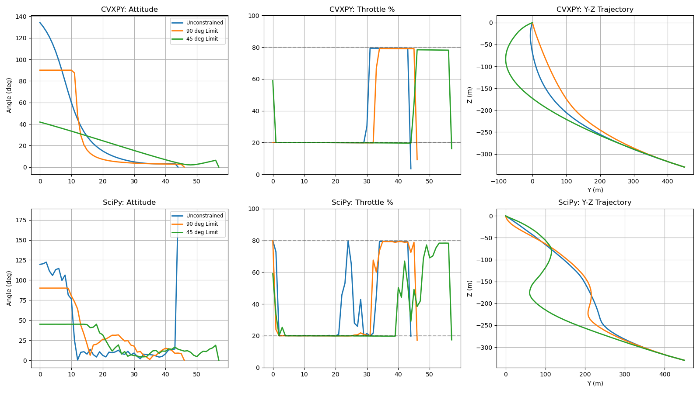

# Soft Landing Optimizer (Lossless Convexification + Convex Optimization)

This repository implements a **powered-descent guidance** (PDG) / **soft-landing** trajectory optimizer based on **lossless convexification**. The core idea is to transform a class of nonconvex thrust-magnitude and thrust-pointing constraints into a **convex second-order cone program (SOCP)** that can be solved reliably with modern convex solvers.

The implementation follows the formulation in:

- **B. Açıkmeşe, J. M. Carson III, and L. Blackmore**, *“Lossless Convexification of Nonconvex Control Bound and Pointing Constraints of the Soft Landing Optimal Control Problem,”* **IEEE Transactions on Control Systems Technology**, 21(6):2104–2113, 2013.  
  DOI: https://doi.org/10.1109/TCST.2012.2237346  
  (Author PDF mirror) https://www.larsblackmore.com/iee_tcst13.pdf

---

## What this project contains

### 1) `soft_landing_optimizer.py` (CVXPY, convex)
Solves a **two-stage prioritized guidance problem**:

1. **Problem 3 (Convex relaxed minimum landing error):**  
   minimize lateral landing error in the **Y–Z plane** (target at `q = [0,0]`) subject to dynamics and constraints.
2. **Problem 4 (Convex relaxed minimum fuel):**  
   minimize total “thrust usage” (proxy for fuel) subject to the same constraints **and** landing within the best error found in Problem 3.

It then plots the 3D trajectory.

### 2) `compare_solver.py` (CVXPY vs SciPy/SLSQP)
Runs the same discretized problem under several **thrust-pointing limits** and compares:

- **CVXPY (convex SOCP)** approach (fast, robust)
- **SciPy SLSQP (general nonlinear constrained optimization)** baseline (typically much slower and more sensitive to initialization)

It generates a combined plot and prints summary tables (fuel used, flight time, CPU time).

---

## Screenshots

### 3D trajectory (`soft_landing_optimizer.py`)


### Geometry: glide-slope constraint


### Problem statement and convex relaxation (from the reference paper)


### Dynamics model (from the reference paper)


### CVXPY vs SciPy comparison (`compare_solver.py`)


---

## Constraints (high level)

The landing problem is constrained by:

- **Terminal constraints**: touchdown altitude and velocity.
- **Glide-slope constraint**: prevents shallow approaches and subsurface paths.
- **Velocity bound**: caps speed along the trajectory.
- **Thrust magnitude bounds** (via convex relaxation) corresponding to throttle bounds.
- **Thrust pointing constraint**: keeps thrust within a cone about the vertical axis.

In the scripts, the “vertical” axis is the **x-axis** (`e1 = [1,0,0]`), with gravity `g = [-3.71, 0, 0] m/s²`.

---

## Repository structure

```text
Soft-Landing-Optimizer-Project/
├─ soft_landing_optimizer.py
├─ compare_solver.py
├─ README.md
└─ img/
   ├─ trajectory.png
   ├─ combined_solver_comparison.png
   ├─ glideslope.png
   ├─ dynamics.png
   ├─ problem_formulation.png
   └─ problem_solution.png
```

---

## Requirements

This repo uses standard scientific Python tooling:

- Python 3.8+ recommended (older versions may work)
- numpy
- matplotlib
- cvxpy
- scipy (only required for `compare_solver.py`)

Install (virtual environment recommended):

```bash
python -m venv .venv
source .venv/bin/activate        # macOS/Linux
# .venv\Scripts\activate         # Windows (PowerShell)

pip install -U pip
pip install numpy matplotlib cvxpy scipy
```

Notes:
- CVXPY will choose an appropriate solver automatically. In `compare_solver.py`, the code tries **ECOS** first and falls back to **SCS**.
  See the CVXPY solver documentation: https://www.cvxpy.org/tutorial/solvers/index.html

---

## How to run

### A) Solve and plot a single optimal trajectory (CVXPY)

```bash
python soft_landing_optimizer.py
```

Expected output:
- A 3D trajectory plot (rendered in a Matplotlib window)

### B) Compare CVXPY vs SciPy (SLSQP)

```bash
python compare_solver.py
```

Expected output:
- Saves a figure named `combined_solver_comparison.png` (by default in the current directory)
- Prints two tables summarizing fuel and timing
- Plots attitude, throttle, and Y–Z trajectories for both solvers

> Tip: if you want the image to appear in this README, save it into `img/`:
> - either move it after running, or
> - change `plt.savefig('combined_solver_comparison.png')` to `plt.savefig('img/combined_solver_comparison.png')`.

---

## Example numerical results

A representative run of `compare_solver.py` produced:

```text
TABLE: CVXPY Solver Results
Scenario                  | Fuel (kg)  | Flight Time (s) | CPU Time (s)
----------------------------------------------------------------------
Unconstrained             | 198.8      | 45.00           | 0.1128
90 deg Limit              | 200.6      | 47.00           | 0.0948
45 deg Limit              | 220.4      | 58.00           | 0.1222
======================================================================

TABLE: SciPy (SLSQP) Solver Results
Scenario                  | Fuel (kg)  | Flight Time (s) | CPU Time (s)
----------------------------------------------------------------------
Unconstrained             | 217.5      | 45.00           | 18.7846
90 deg Limit              | 212.2      | 47.00           | 20.1338
45 deg Limit              | 227.7      | 58.00           | 39.6646
======================================================================
```

Interpretation (in one sentence): **the convex formulation solves in ~0.1 s, while a generic nonlinear solver can take tens of seconds and may be less predictable**, especially as constraints tighten.

---

## Customization

Common edits you might try:

- **Initial condition:**  
  `x0_val = np.array([rx0, ry0, rz0, vx0, vy0, vz0])`

- **Target point in Y–Z plane:**  
  `target_q = np.array([qy, qz])`

- **Pointing constraint cone half-angle:**  
  Change `theta_deg` in the scenarios list (smaller = stricter).

- **Glide-slope angle:**  
  `glidelslope_angle = 30.0` (degrees)

- **Time discretization:**  
  `dt` and `tf` control fidelity vs speed. Euler with `dt=1 s` is simple but coarse; decreasing `dt` improves accuracy at increased solve time.

---

## Known limitations (honest engineering)

- **Forward Euler discretization** is easy to read but not the most accurate; higher-order integration or direct collocation generally improves fidelity.
- This is a **3-DoF translation** model (position/velocity). It does not model full 6-DoF rigid-body attitude dynamics, actuator dynamics, or aerodynamics.
- The SciPy baseline uses **SLSQP** (Sequential Least Squares Programming). It is not specialized for large sparse optimal-control transcription problems and can be sensitive to initial guesses.
  SciPy docs: https://docs.scipy.org/doc/scipy/reference/optimize.minimize-slsqp.html

---

## References and further reading

1. Açıkmeşe, Carson III, Blackmore (2013). *Lossless Convexification…* IEEE TCST.  
   DOI: https://doi.org/10.1109/TCST.2012.2237346

2. CVXPY documentation (solvers):  
   https://www.cvxpy.org/tutorial/solvers/index.html

3. SciPy optimization (`minimize`, SLSQP):  
   https://docs.scipy.org/doc/scipy/reference/generated/scipy.optimize.minimize.html

---
